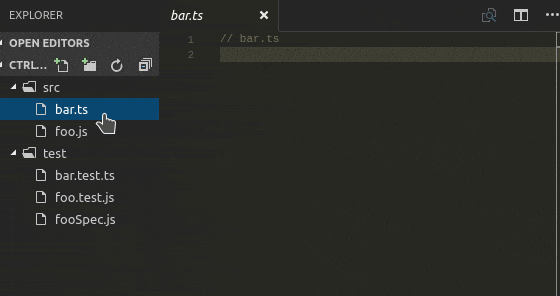

# Switch the unit test / production code.

This extension supports that switch the `unit test` / `production code`.

[](https://travis-ci.org/takas-ho/vscode-unittest-switcher)
[](https://ci.appveyor.com/project/takas-ho/vscode-unittest-switcher/branch/master "Master Branch Status")

## Features
- Switch the `unit test` / `production code`.
    - Editor context menu `Go to Test/Code`.
    - Keyboard Shortcut `CTRL + 9` key.
    - Invoke `>Go to Test/Code` to the Command Palette(F1).
- Customizable suffix rule of `unit test`.

#### Example



- If you are editing a `foo.js`, When the Command Palette(F1) `Go to Test/Code`(or press key `CTRL + 9` on editor), switched to `fooSpec.js`.

## Settings
- suffix rule of `unit test`.
```json
{
    // Suffix rule of unit test (case sensitive)
    "unittest-switcher.unittest.suffix": [
        "Spec",
        "-spec",
        "_spec",
        ".spec",
        "Test",
        "-test",
        ".test",
        "_test"
    ],
}
```
- Default switchig rule is...

|Switch?|production code|unit test|
|----|----|----|
|Yes|foo.js|fooSpec.js|
|Yes|bar.js|bar-spec.js|
|Yes|baz.service.ts|baz.service.spec.ts|
|Yes|qux.rb|qux_spec.rb|
|Yes|Foo.java|FooTest.java|
|Yes|bar.js|bar-test.js|
|Yes|baz.ts|baz.test.ts|
|No|qux.**js**|qux.test.**ts**|
|No|foo.**js**|fooSpec.**js.map**|

## Keyboard Shortcuts

The extension defines a editor keyboard shortcut for the `CTRL + 9` key.

## Hommage

It pays tribute to [QuickJUnit](https://github.com/kompiro/quick-junit).

## Release Notes

### 0.1.4

- Added default switching rule '_test'.

### 0.1.3

- Fix the settings warning 'Incorrect type. Expect one of String'.

### 0.1.2

- Added default switching rule '.spec'.
- Fix comments.

### 0.1.1

- Adopted the icon.
- Added default switching rule '_spec'.

### 0.1.0

- Added suffix settings of unit test.
- Added editor context menu `Go to Test/Code`.
- Fix toggle unit test / production code on Windows.

### 0.0.2

- Release to minimum features.

## License

MIT &#xA9; 2016 Takashi HOMMA (takas-ho)
